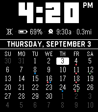
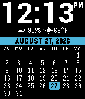
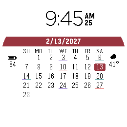
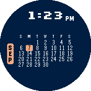
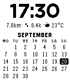
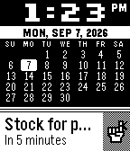
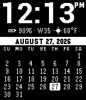

# MonthGrid

**Your month at a glance.** A retro calendar watchface for Pebble: big time on top, a
prioritized status line, and a full month grid with today highlighted — a from-scratch
re-implementation (and extension) of the abandoned *CalendaWatch*, built on the current
official Pebble SDK.

<p align="center">
  
</p>

Every Pebble, its own look — one scene per model:

| Pebble Time 2 (emery) | Pebble Time (basalt) | Pebble Round 2 (gabbro) | Pebble Time Round (chalk) |
|:---:|:---:|:---:|:---:|
|  |  |  |  |
| Event dots, ruled banner, adjacent months, Digital font | Ice theme, full-date banner, heart rate & weather | Newsprint theme, custom marker colors, seconds | Midnight theme, Pixel font, round crescent layout |

| Pebble 2 HR (diorite) | Pebble 2 Duo (flint) | Pebble Classic (aplite) |
|:---:|:---:|:---:|
|  |  |  |
| Paper theme, 24-hour, Monday start, metric units | Compressed under a Timeline Peek | Classic look with week number on the original Pebble |

## Features

- **Full month calendar** with today inverted; optional dimmed previous/next-month days
  filling the whole grid.
- **Banner options** — the inverted bar shows the month name (default) or full dates:
  month+day, weekday+month+day, with or without the year. Ordering follows your region
  (US: `AUGUST 25`; elsewhere: `25 AUGUST`), names are localized, and long combinations
  automatically shorten (`WEDNESDAY, SEPTEMBER 30` → `WED, SEP 30`) so nothing clips.
- **Big time display** with five selectable font styles — Roboto (default), Digital
  (LECO), Pixel (Silkscreen), Bitham bold / light — in three sizes.
  12-hour mode **never shows a leading zero**. Optional seconds (off by default; the
  face ticks once a minute unless enabled).
- **Prioritized status line** — add as many items as you like (up to 8) in priority
  order; the settings page grows a new row as you fill the last one and closes gaps
  when you set a row to Remove. As many as fit on the watch are shown. Items with nothing to report are hidden automatically. Choose from:
  - Battery (icon + %, charge bolt while plugged)
  - Weather (condition icon + temperature, °F/°C)
  - Steps, Distance walked (mi/km), Heart rate, Active minutes, Calories, Sleep
  - Week number (ISO), Next alarm, Disconnected alert
- **Weather** via [Open-Meteo](https://open-meteo.com/) (the pattern recommended by the
  official Pebble docs — no API key, no account). Cached on the watch, refreshed every
  30 minutes, shown only while fresh (<3 h).
- **Calendar event markers** — up to three iCal/ICS subscriptions (e.g. Google
  Calendar's *Secret address in iCal format*) mark days with events. Two styles: a
  1px underline that splits into per-calendar color sections, or small squares —
  color-coded per calendar on color watches, sized per display density. The squares
  show up to three markers per day based on how many events you have, prioritising
  one marker per calendar before doubling up. The URLs stay
  on your phone; the watch only ever receives a per-day bitmask.
- **Timeline Quick View aware** — when the system overlay appears, the face compresses
  (smaller time, then status, banner, header yield) instead of cropping the grid.
- **Round-native layout** on Pebble Time Round and Pebble Round 2: time on the top arc,
  single-letter weekday header, grid across the wide middle of the circle, month stacked
  in the left crescent, status metrics stacked in the right crescent.
- **Ten color themes plus Custom** — Classic (white-on-black, default), Paper, Amber
  terminal, Ice, Crimson, Midnight, Terminal green, Sunset, Violet and Newsprint, all
  high-contrast and legible with the backlight off. Custom lets you pick the
  background, text and accent yourself (those pickers only appear when Custom is
  selected). B&W watches use Classic/Paper.
- **Month banner styles** — filled bar (default), plain text, or ruled with a 1px line
  above and below.
- Sunday / Monday / Saturday week start, vibrate-on-disconnect.

## Platforms

All seven: `aplite`, `basalt`, `chalk`, `diorite`, `emery` (Pebble Time 2), `flint`
(Pebble 2 Duo), `gabbro` (Pebble Round 2). Health metrics need a health-capable watch;
heart rate needs a watch with an HRM (detected at runtime, hidden otherwise).

## Building

Requires the official [Pebble SDK](https://developer.repebble.com/) (`pebble-tool` ≥ 5,
SDK core ≥ 4.33):

```sh
pebble build
```

Run in the emulator:

```sh
pebble install --emulator basalt
pebble emu-set-timeline-quick-view on    # test the Quick View compression
pebble emu-app-config                    # open the settings page
```

Install on a watch (Dev Connect / Developer Connection in the official app):

```sh
pebble install --cloudpebble             # or: pebble install --phone <PHONE_IP>
```

The sideloadable bundle is `build/monthgrid.pbw`.

## Tests

The ICS recurrence engine (the trickiest part of the phone-side JS) has a Node test
suite — plain CommonJS, no dependencies:

```sh
node tools/test_ics.js
```

## Calendar-dot limitations (best-effort ICS)

The phone JS runtime has no timezone database, so `TZID`/floating event times are
treated as phone-local (UTC times are converted properly). The RRULE subset covers
FREQ=DAILY/WEEKLY/MONTHLY/YEARLY with INTERVAL, COUNT, UNTIL, BYDAY (weekly),
BYMONTHDAY (single), and EXDATE; events with ordinal BYDAY (e.g. "2nd Tuesday"),
BYSETPOS, and other exotica mark only their first instance rather than guessing.

## Bundled fonts

The Silkscreen font (used for the "Pixel" time style) is included under its own
license — see `resources/fonts/OFL-Silkscreen.txt`.
